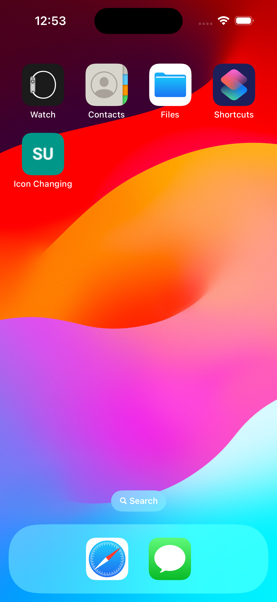
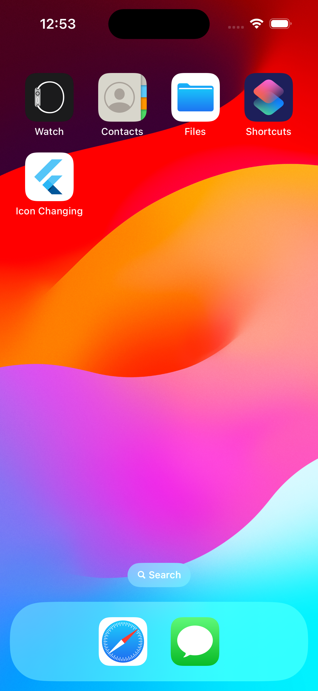

# Dynamic App Icon Change using Flutter

## Project Overview

This project demonstrates how to dynamically change the app icon in a Flutter application using the `flutter_dynamic_icon` package. The inspiration for this project came from my experience with the Duolingo app, which offers users the option to change the app icon as a reward for maintaining a long streak. I wanted to replicate and understand this functionality within a Flutter application, making it possible to update the app icon dynamically based on user interactions or specific conditions.

## Features

- **Dynamic App Icon Change**: The app allows users to change the app icon based on specific triggers or conditions.
- **Cross-Platform Support**: The project explores how this feature can be implemented on iOS platform. (Android Not Supported)

## Getting Started

### Prerequisites

- Flutter SDK (version 2.0 or above)
- Dart programming language
- Basic understanding of Flutter widgets and state management
- Android Studio/Xcode for emulation and testing

### Installation

1. Clone the repository:
   ```bash
   git clone
   cd dynamic-app-icon-flutter
   ```

2. Install the required packages:
   ```bash
   flutter pub get
   ```

3. Run the app on an emulator or connected device:
   ```bash
   flutter run
   ```

### Image Showcase

Below are the images showcasing the app icon before, during, and after the dynamic change:

<div style="display: flex; justify-content: center;">
    
    
    
</div>

### Usage

1. After running the app, you will be presented with a simple UI.
2. The app will demonstrate how to dynamically change the app icon based on specific conditions.
3. You can modify the conditions or triggers in the code to customize the icon change behavior.

### Reference

This project was guided by the article "Dynamic App Icons in Flutter: Ultimate Guide" available on Medium. You can check it out [here](https://medium.com/@jauntybrain/dynamic-app-icons-in-flutter-ultimate-guide-f67f63681b40).


### Acknowledgments

- Special thanks to the author of the Medium article that guided the development of this project.

## Conclusion

This project is a small but practical demonstration of how Flutter can be used to create dynamic and interactive applications. The ability to change app icons dynamically is a powerful feature that can enhance user engagement, as seen in apps like Duolingo.

Feel free to explore the code, modify it for your needs, and implement similar features in your own Flutter projects!